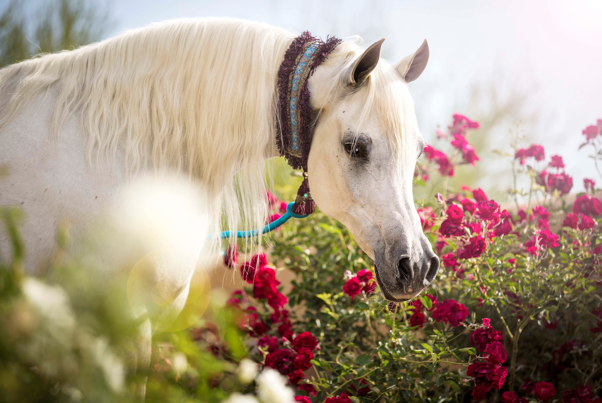

# Инструкция по языку MarkDown

## Стилизация текст
Обычный текст набираем как есть.

Новая строка.

**Полужирный текст**

*Курсив*

Цитирование в языке MarkDown
> Первый уровень цитирование
>> Второй уровень цитирования

## Списки
### Ненумерованный список
* Лист
* Лист 

### Нумерованный список
1. Лист
2. Лист

## WEB ссылки
Текст [пример ссылки](http/example.com "Всплывающая подсказка")

# Как добавлять картинки в Markdown
Это лошадь

